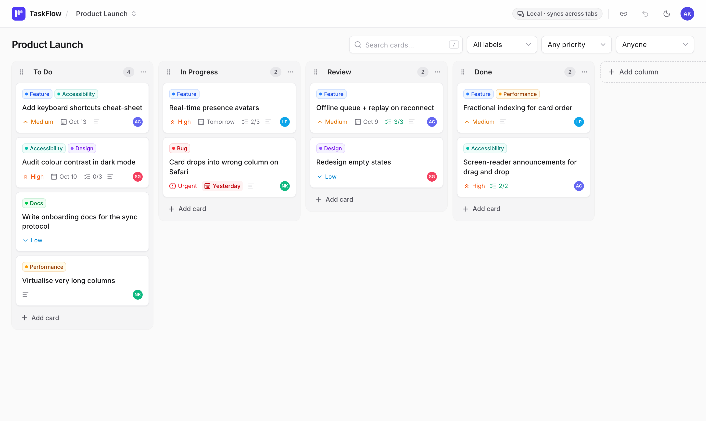
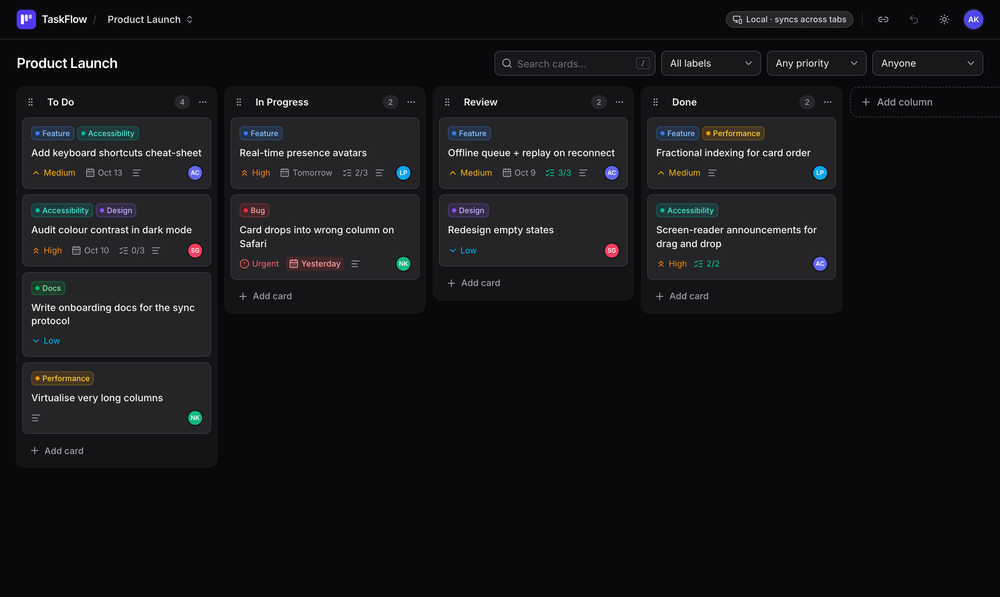
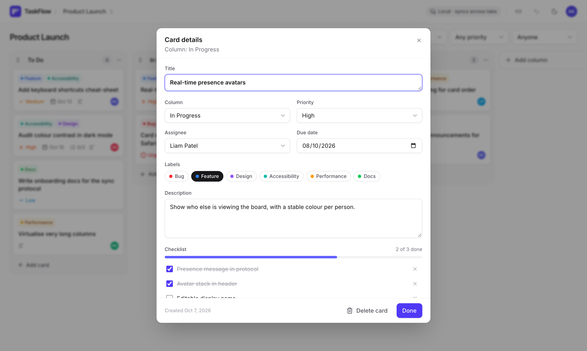
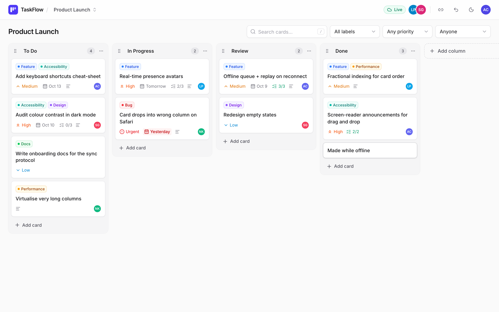
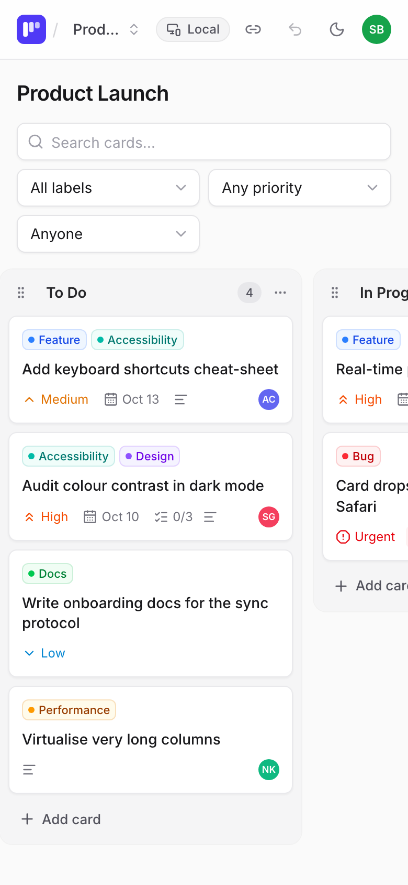
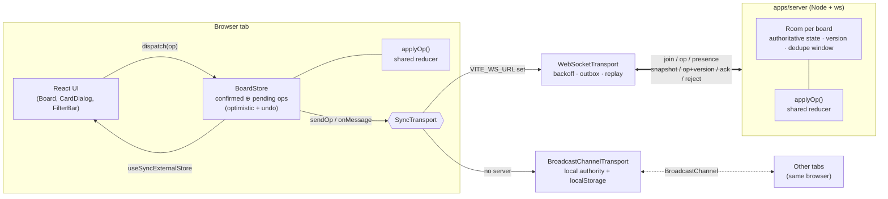

# TaskFlow — Real-time Kanban Board

**A collaborative Kanban board with optimistic real-time sync, keyboard-accessible drag and drop, and a hand-built accessible component library — React 19, TypeScript, WebSockets.**

[](https://github.com/Kansal002/taskflow/actions/workflows/ci.yml)

**Live demo:** `https://<your-site>.netlify.app`

> **Try the real-time sync:** open the demo in **two browser tabs** side by side, then drag a card or
> edit a title in one — it appears instantly in the other. No account, no backend needed.
> With the optional WebSocket server deployed, the same works across devices and people.



<!-- Replace with a GIF of two windows syncing (e.g. recorded with Kap / ScreenToGif): docs/screenshots/sync-demo.gif -->

<table>
  <tr>
    <td></td>
    <td></td>
  </tr>
  <tr>
    <td></td>
    <td align="center"></td>
  </tr>
</table>

---

## Features

- **Real-time collaboration** — every edit is a small operation broadcast to everyone on the board; changes appear
  instantly (optimistic UI) and reconcile with the server's authoritative order.
- **Works offline / on flaky networks** — ops made while disconnected are queued and replayed on reconnect;
  automatic reconnect with exponential backoff + jitter; connection indicator (**Live / Reconnecting… / Offline**,
  with "_n_ changes queued").
- **Zero-backend demo mode** — without a server URL, tabs of the same browser sync via `BroadcastChannel` and the
  board persists to `localStorage`.
- **Drag and drop** (dnd-kit) — cards within and across columns, column reordering, **full keyboard support**
  (Space to pick up, arrows to move, Space/Enter to drop, Escape to cancel) and **screen-reader announcements**
  that use card and column names.
- **Card details** — title, description, coloured labels, priority, assignee, due date (overdue/today highlighting),
  checklist with progress, move-to-column. Inline quick-add, inline rename for board and columns.
- **Search & filters** — text (accent-insensitive, multi-term), label, priority, assignee. Filters live in the URL,
  so a filtered view is shareable. Press <kbd>/</kbd> to search.
- **Presence** — avatars of who else is on the board; random name + colour on first visit, editable.
- **Multiple boards** — board switcher with recent boards; every board has a shareable URL (`/b/:boardId`), and a
  card can be deep-linked (`?card=…`).
- **Undo** — <kbd>Ctrl</kbd>/<kbd>⌘</kbd>+<kbd>Z</kbd> or the toolbar button; deletions show an **Undo** toast.
- **Dark mode**, responsive layout (snap-scrolling columns on mobile, long-press to drag on touch).

## Tech stack

| Area          | Choice                                                                                                             |
| ------------- | ------------------------------------------------------------------------------------------------------------------ |
| Frontend      | React 19, TypeScript (strict), Vite 8, Tailwind CSS v4, React Router 8, lucide-react                               |
| Drag and drop | @dnd-kit/core + @dnd-kit/sortable                                                                                  |
| Real-time     | `ws` WebSocket server (Node), BroadcastChannel fallback, shared pure reducer                                       |
| Testing       | Vitest, React Testing Library, user-event, jsdom, v8 coverage                                                      |
| Tooling       | npm workspaces monorepo, ESLint (typescript-eslint, jsx-a11y, react-hooks), Prettier, Storybook 10, GitHub Actions |
| Deploy        | Netlify (static web) + Render (WebSocket server)                                                                   |

## Architecture

```
taskflow/
├── apps/
│   ├── web/              React SPA (Netlify)
│   │   └── src/
│   │       ├── components/ui/   accessible primitives (Dialog, DropdownMenu, Toast, …) + Storybook stories
│   │       ├── features/        board (DnD), card dialog, filters, header
│   │       ├── sync/            BoardStore + pluggable transports
│   │       └── pages/
│   └── server/           Node WebSocket sync server (Render)
├── packages/
│   └── shared/           types, wire protocol + validation, pure reducer, fractional indexing, seed data
└── scripts/ws-smoke.mjs  end-to-end check against the built server
```



The same pure, framework-free reducer in `packages/shared` runs **optimistically in the browser** and
**authoritatively on the server**, so both sides compute identical state from identical ops.

### Wire protocol

| Direction       | Message                   | Purpose                                                                  |
| --------------- | ------------------------- | ------------------------------------------------------------------------ |
| client → server | `join { boardId, user }`  | subscribe to a board                                                     |
| client → server | `op { op }`               | an operation with a client-generated id                                  |
| client → server | `presence { user }`       | name / colour changed                                                    |
| server → client | `snapshot { board }`      | full state + version on join / reconnect                                 |
| server → client | `op { op, version }`      | broadcast to **everyone**, including the sender (for whom it is the ack) |
| server → client | `ack { opId, version }`   | a re-sent op that was already applied (dedupe)                           |
| server → client | `reject { opId, reason }` | op couldn't be applied (e.g. card deleted meanwhile) → client rolls back |
| server → client | `presence { users }`      | who is on the board                                                      |

Operations: `board.rename`, `card.create`, `card.update`, `card.move`, `card.delete`, `column.create`,
`column.rename`, `column.reorder`, `column.delete`. Every inbound message is validated at runtime on the
server (`parseClientMessage`) before it reaches the reducer.

## Conflict resolution

TaskFlow uses a **server-authoritative op log with client-side rebasing** — simple, predictable, and
sufficient for a Kanban board (no CRDT library needed):

1. **Optimistic apply.** The client applies an op immediately to its view and sends it with a unique op id.
   The view is always `confirmed state ⊕ pending ops`.
2. **Total order from the server.** The server applies ops in arrival order and assigns each a monotonically
   increasing `version`, then broadcasts it. Clients apply broadcasts to their confirmed state and **re-apply
   their still-pending ops on top** (rebase). The sender drops its op from `pending` when it sees its own id.
3. **Last-writer-wins per field.** State is normalised (maps keyed by id) and `card.update` carries only the
   fields that changed, so concurrent edits to _different_ fields (Alice renames, Bob changes priority) both
   survive; edits to the _same_ field resolve to whichever reached the server last.
4. **Fractional indexing for order.** Cards and columns carry a base-62 `order` key; a move generates a key
   _between_ its new neighbours and touches only the moved item. Two people moving different cards never
   clobber each other. If two clients pick the identical key for the same gap, ties break deterministically by
   id, and the next insert into that gap skips over the tie.
5. **Graceful no-ops.** Ops that reference something that no longer exists (moving a card someone just deleted)
   are rejected by the reducer instead of corrupting state; the originating client rolls back and shows a toast.
6. **At-least-once delivery, exactly-once effect.** The WebSocket transport keeps an outbox of un-acknowledged
   ops and replays it after every reconnect; the server remembers recent op ids per room and acks duplicates
   without re-applying them.

**Undo** is computed client-side: each action records its inverse ops against the pre-action state
(`invertOp`), so undo is just another set of ops that syncs to everyone.

## Accessibility

- **Keyboard-first drag and drop:** cards and column handles are focusable; <kbd>Space</kbd> picks up, arrow keys
  move between positions and columns, <kbd>Space</kbd>/<kbd>Enter</kbd> drops, <kbd>Escape</kbd> cancels.
  <kbd>Enter</kbd> on a card opens it.
- **Live announcements** during drags ("Picked up card “Fix login”, in column “To Do”, position 1 of 4") instead
  of dnd-kit's default id-based messages; connection status and filter result counts are `role="status"` regions.
- **Dialogs** trap focus, close on <kbd>Escape</kbd>, restore focus to the opener, and make the rest of the app
  `inert`. **Menus** implement the APG menu-button pattern (roving tabindex, arrows, Home/End, typeahead).
- Visible `:focus-visible` rings everywhere, a skip link, labelled form controls with described hints/errors,
  colour never used as the only signal (labels have text, priorities have icons + text), `prefers-reduced-motion`
  respected.
- `eslint-plugin-jsx-a11y` runs in CI with zero warnings allowed.

See [`apps/web/src/components/ui/README.md`](apps/web/src/components/ui/README.md) for the component library.

## Getting started

Requires Node ≥ 22.12 (Node 24 LTS recommended — see `.nvmrc`).

```bash
npm install
npm run dev          # web on http://localhost:5173 + sync server on :8787
```

`npm run dev` starts both apps, but the web app only talks to the server when `VITE_WS_URL` is set:

```bash
cp apps/web/.env.example apps/web/.env
# then set: VITE_WS_URL=ws://localhost:8787
```

Leave it empty to use local (cross-tab) mode.

### Scripts (repo root)

| Script                  | What it does                                                              |
| ----------------------- | ------------------------------------------------------------------------- |
| `npm run dev`           | web + server concurrently (hot reload)                                    |
| `npm run build`         | production build of web (`apps/web/dist`) and server (`apps/server/dist`) |
| `npm test`              | all tests (shared, server, web)                                           |
| `npm run test:coverage` | tests with v8 coverage (`coverage/`)                                      |
| `npm run lint`          | ESLint, zero warnings allowed                                             |
| `npm run format`        | Prettier                                                                  |
| `npm run typecheck`     | `tsc --noEmit` in every workspace                                         |
| `npm run storybook`     | component library on http://localhost:6006                                |
| `npm run smoke:ws`      | starts the built server, connects two clients, verifies an op round-trip  |

## Deployment

### 1. Web → Netlify

`netlify.toml` already configures everything (build from the repo root so workspaces resolve, publish
`apps/web/dist`, SPA fallback `/* → /index.html 200`, Node 24, cache headers).

1. Netlify → **Add new site → Import an existing project** → pick the repo.
2. Deploy. The site works immediately in local mode (open two tabs to see sync).

### 2. Sync server → Render (free tier)

1. Render → **New → Blueprint** → pick the repo. `render.yaml` defines a free Node web service that builds
   `apps/server`, starts `node apps/server/dist/index.js`, and health-checks `/health`. Render provides `PORT`.
2. Optionally set `ALLOWED_ORIGINS=https://<your-site>.netlify.app` to restrict which sites may connect.
3. A `Dockerfile` (`apps/server/Dockerfile`) is included if you prefer a container host.

### 3. Connect them

In Netlify → **Site configuration → Environment variables**, add
`VITE_WS_URL = wss://<your-service>.onrender.com` and redeploy. The header badge switches from **Local** to
**Live**.

> Render's free instances sleep when idle; the first connection after a while takes a few seconds — the UI shows
> "Connecting…" and the client retries automatically.

## Testing

- **Shared:** reducer (every op, immutability, referential identity), fractional indexing (hundreds of
  insertions into one gap), concurrent-move convergence regardless of arrival order, invert/undo round-trips,
  protocol validation.
- **Server:** real `ws` server on an ephemeral port — snapshot on join, broadcast + versioning, room isolation,
  dedupe, rejects, presence join/leave, origin allow-list, room eviction.
- **Web:** `WebSocketTransport` against a mock socket (backoff timing, offline queue + in-order replay, ack
  handling, online/offline events), `BroadcastChannelTransport` with an in-memory bus, `BoardStore` rebase /
  reject / undo, Dialog focus trap, DropdownMenu keyboard model, Toast live regions, filters, full
  create → edit → move → delete → undo flow through the real app, and **keyboard drag and drop** (dnd-kit's
  keyboard sensor with a faked layout).

## Known limitations

- Server state is in memory; a restart (or Render free-tier spin-down) resets boards to their seed. Adding
  persistence (e.g. SQLite/Redis snapshots of each room) is the natural next step.
- No authentication — anyone with a board link can edit it (by design for the demo).
- Same-field conflicts are last-writer-wins; there is no character-level merge for simultaneous edits of the
  same description.

## License

[MIT](LICENSE)
